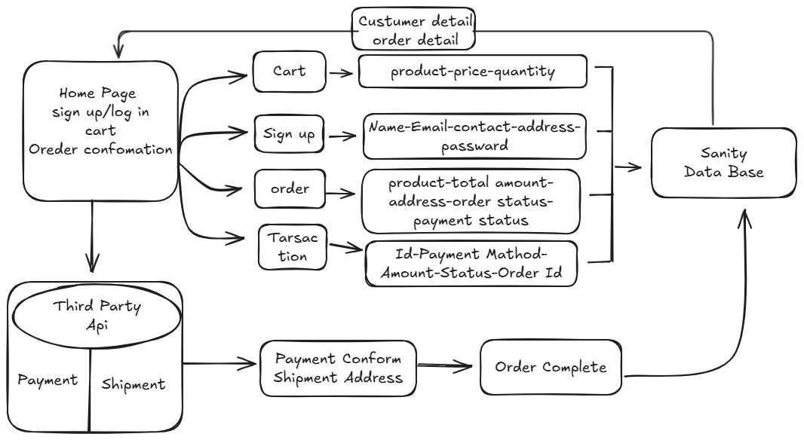

# Day 2
# E-commerce System Documentation

## System Overview

Our e-commerce platform is built with a modern tech stack, integrating various services to provide a seamless shopping experience. The system uses Sanity as its primary database and incorporates third-party APIs for payment processing and shipment handling.

## Core Features

### 1. User Management
- Sign Up/Login functionality
- Customer profile management
- Authentication and authorization

### 2. Shopping Experience
- Product browsing and search
- Cart management
- Order processing
- Payment integration
- Shipment tracking

## API Endpoints

# API Documentation

This document provides API endpoints for the eCommerce store.

## API Endpoints Excel Sheet

You can download the detailed **API Endpoints** Excel file from the link below:

[Download API Endpoints Excel File](./Apis%20End%20point.xlsx)


## Error Responses

### Standard Error Format

```json
{
  "error": {
    "code": "string",
    "message": "string",
    "details": object | null
  }
}
```

### Common Error Codes

- `400`: Bad Request
- `401`: Unauthorized
- `403`: Forbidden
- `404`: Not Found
- `422`: Validation Error
- `500`: Internal Server Error


### Example Error Response

```json
{
  "error": {
    "code": "VALIDATION_ERROR",
    "message": "Invalid input data",
    "details": {
      "email": "Must be a valid email address",
      "password": "Must be at least 8 characters long"
    }
  }
}
```

## Rate Limiting

API requests are limited to:

- 100 requests per minute for authenticated endpoints
- 20 requests per minute for unauthenticated endpoints


Rate limit headers included in responses:

```plaintext
X-RateLimit-Limit: 100
X-RateLimit-Remaining: 95
X-RateLimit-Reset: 1640995200
```

## Webhook Events

### Available Events

- `order.created`
- `order.updated`
- `payment.succeeded`
- `payment.failed`
- `shipping.created`
- `shipping.updated`


### Webhook Payload Format

```json
{
  "event": "string",
  "timestamp": "string",
  "data": {
    "id": "string",
    "type": "string",
    "attributes": object
  }
}
```

## Testing

### Test Cards

- Success: `4242 4242 4242 4242`
- Decline: `4000 0000 0000 0002`
- Authentication Required: `4000 0025 0000 3155`



# Day 3

# E-Commerce Hackathon Project

This project is an e-commerce platform developed for the hackathon. The goal of this project is to create a seamless, user-friendly, and scalable e-commerce website, where users can browse products, add them to their cart, view product details, and make purchases. The application is integrated with a headless CMS (Sanity) to manage dynamic content such as product details, images, and stock levels.

## Features

- **Product Browsing**: Users can browse through featured products, view detailed descriptions, prices, and availability.
- **Product Search**: Easily search products using a search bar.
- **Shopping Cart**: Add products to the shopping cart, update quantities, and remove products.
- **Wishlist**: Users can add products to their wishlist for future reference.
- **Product Details Page**: A detailed page for each product with more information, including images and specifications.
- **Responsive Design**: The application is designed to be responsive, ensuring a seamless experience on both desktop and mobile devices.

## Tech Stack

- **Frontend**: 
  - **React**: A JavaScript library for building user interfaces.
  - **Next.js**: A React framework for server-side rendering and static site generation.
  - **Tailwind CSS**: A utility-first CSS framework for styling.
  - **React Icons**: For adding customizable icons to the UI.
  - **Next Image**: For optimized image handling.

- **Backend**:
  - **Sanity CMS**: A headless CMS for managing dynamic content, including products, images, and stock levels.
  - **Sanity API**: To fetch product data and content from the CMS.

- **State Management**:
  - **Redux**: A state management library to handle the application state, including the shopping cart and wishlist.

## API Integration with Sanity

This project demonstrates how to integrate an external API with **Sanity CMS** to manage and display dynamic content such as products, categories, and more.

### 1. Importing Data from an External API to Sanity
- **Step 1.1**: Set up Sanity Studio and define schemas for products, categories, and other required data.
- **Step 1.2**: Import product data from an external API (for example, from a public API or custom backend).
- **Step 1.3**: Map the fetched data to the defined schemas and push it to your Sanity dataset.

### 2. Fetching and Using Data in Your Project
- **Step 2.1**: Use **Groq** queries to fetch product data from the Sanity dataset.
- **Step 2.2**: Implement API calls in your Next.js project to retrieve the data from Sanity using the Sanity Client.
- **Step 2.3**: Display the fetched data dynamically in the frontend, such as on product listing pages and product detail pages.

## Dynamic Routing with Redux

Dynamic routing allows you to display product details dynamically based on the product ID in the URL. Using **Next.js**'s dynamic routes and **Redux**, the selected product's data is managed globally across the application.

### 1. Set up Redux Store
First, we create a Redux slice to manage the state for the selected product.

```javascript
// redux/singleProductSlice.js

import { createSlice } from '@reduxjs/toolkit';

const initialState = {
  selectedProduct: null,
};

const singleProductSlice = createSlice({
  name: 'singleProduct',
  initialState,
  reducers: {
    setSingleProduct: (state, action) => {
      state.selectedProduct = action.payload;
    },
  },
});

export const { setSingleProduct } = singleProductSlice.actions;
export const selectSingleProduct = (state) => state.singleProduct.selectedProduct;
export default singleProductSlice.reducer;

```   

# DAY 4

# Hackathon E-commerce Project

## Project Overview
This e-commerce project is being developed as part of a hackathon. The goal is to create a functional and user-friendly online shopping platform where users can browse items, add them to the cart, manage their wishlist, and search for products using filters.

## Features Implemented Today
### 1. **Component Creation**
   Today, I focused on creating the core components for the e-commerce site. These components serve as building blocks for the user interface and will be reused throughout the platform. Some key components created include:
   - **Product Card**: Displays product information such as name, price, image, and a button to add it to the cart.
   - **Product List**: A container for the individual product cards that dynamically populate based on the available inventory.
   - **Cart**: Displays the list of items the user has added to the cart along with the total price and a checkout option.
   - **Wishlist**: Allows users to save their favorite items for future reference or purchase.
   - **Search Bar**: A search field that allows users to filter products by name.

### 2. **Add to Cart Functionality**
   I implemented the **Add to Cart** functionality, which allows users to add products to their cart. 
   - Users can click on the "Add to Cart" button located on each product card.
   - The cart dynamically updates to reflect the added item, including the item name, quantity, and total price.
   - The cart persists the added items even if the user navigates to other pages or reloads the page.

### 3. **Wishlist Feature**
   A **Wishlist** feature was also added today, allowing users to save products they are interested in but not ready to purchase.
   - Users can click on a "Add to Wishlist" button to save products.
   - The wishlist is separate from the shopping cart and provides users with the ability to view and manage their saved items later.
   - A simple UI was implemented to view the wishlist and remove items if desired.

### 4. **Search Bar and Filtering by Name**
   I implemented a **Search Bar** to allow users to filter products by name.
   - The search bar dynamically updates the product list as the user types.
   - The list is filtered based on matching product names, making it easier for users to find specific items.
   - This search functionality enhances the user experience by allowing faster product discovery.

## Future Work
While today’s work focused on building the core components and functionality, the following features and improvements are planned for future development:
   - **User Authentication**: Implementing user login and registration to allow for personalized experiences, including managing the cart and wishlist.
   - **Checkout Process**: Integrating a smooth checkout process with payment options.
   - **Product Sorting and Filters**: Implementing more advanced filtering options such as sorting by price, category, and ratings.
   - **Mobile Responsiveness**: Enhancing the design for mobile devices to ensure accessibility on all screen sizes.

## Conclusion
In today's development, I successfully created reusable components for the platform, implemented the add-to-cart functionality, integrated a wishlist feature, and built a search bar for filtering products by name. These features lay the foundation for a functional e-commerce platform, with many more features planned for completion in the upcoming days of the hackathon.


# DAY 5

# API Testing Report

**Project Name:** E-commerce Platform  
**Testing Date:** January 21, 2025  
**Tested by:** [Your Name]  
**Version:** 1.0

---

## 1. Test Overview

The testing focused on ensuring that the APIs provided by the E-commerce platform function correctly. This includes testing critical endpoints such as authentication, product management, cart management, and user-related actions. The goal was to verify that the API endpoints behave as expected and return correct responses under various scenarios.

---

## 2. Tested API Endpoints

### 2.1 Authentication API
- **Endpoint:** `POST /api/login`
- **Test Description:** Verify that users can log in with valid credentials.
- **Test Steps:**
  1. Send a POST request with a valid username and password.
  2. Check the response status code and body.
- **Expected Result:** 
  - **Status Code:** 200 OK
  - **Response Body:** `{ "token": "valid_jwt_token" }`
- **Result:** Success
- **Details:** The login API returns the expected status code (200 OK) and the authentication token when valid credentials are provided.

---

### 2.2 Signup API
- **Endpoint:** `POST /api/signup`
- **Test Description:** Verify that users can successfully sign up with valid details.
- **Test Steps:**
  1. Send a POST request with a username, email, and password.
  2. Check the response status code and body.
- **Expected Result:**
  - **Status Code:** 201 Created
  - **Response Body:** `{ "message": "User created successfully" }`
- **Result:** Success
- **Details:** The signup API works as expected. A new user is created successfully, and the API returns the correct response body.

---

### 2.3 Get Products API
- **Endpoint:** `GET /api/products`
- **Test Description:** Ensure that the API returns a list of products.
- **Test Steps:**
  1. Send a GET request to retrieve the list of products.
  2. Verify the response contains an array of product objects.
- **Expected Result:**
  - **Status Code:** 200 OK
  - **Response Body:** 
    ```json
    [
      { "id": 1, "name": "Product 1", "price": 100 },
      { "id": 2, "name": "Product 2", "price": 200 }
    ]
    ```
- **Result:** Success
- **Details:** The API returns a list of products with the correct format and data.

---

### 2.4 Add to Cart API
- **Endpoint:** `POST /api/cart`
- **Test Description:** Verify that products can be added to the shopping cart.
- **Test Steps:**
  1. Send a POST request with a product ID and quantity.
  2. Check the response status code and body.
- **Expected Result:**
  - **Status Code:** 201 Created
  - **Response Body:** `{ "message": "Product added to cart" }`
- **Result:** Success
- **Details:** The API successfully adds products to the cart and returns the expected response.

---

### 2.5 Get Cart API
- **Endpoint:** `GET /api/cart`
- **Test Description:** Verify that users can retrieve their cart information.
- **Test Steps:**
  1. Send a GET request to retrieve the user's cart.
  2. Verify that the response contains the correct cart items.
- **Expected Result:**
  - **Status Code:** 200 OK
  - **Response Body:**
    ```json
    {
      "items": [
        { "product_id": 1, "quantity": 2, "price": 100 },
        { "product_id": 2, "quantity": 1, "price": 200 }
      ]
    }
    ```
- **Result:** Success
- **Details:** The API correctly retrieves the user's cart, including the product ID, quantity, and price.

---

## 3. Summary of Findings

- All tested API endpoints, including **Login**, **Signup**, **Get Products**, **Add to Cart**, and **Get Cart**, are functioning correctly.
- The expected responses are returned with the correct status codes and body formats.
- There are no issues with authentication, product listing, or cart management.

---

## 4. Recommendations

- **API Rate Limiting:** Implement rate limiting to prevent abuse of the APIs.
- **Input Validation:** Ensure input validation is implemented for all user inputs to prevent invalid data submissions.
- **Error Handling:** Improve error handling by ensuring clear, consistent error messages for various failure scenarios (e.g., invalid credentials, missing parameters).

---

## 5. Conclusion

The core APIs of the e-commerce platform have been successfully tested and are working as expected. There were no critical issues identified during the testing phase. The APIs are now ready for production use.

**Testing Status:** Passed  
**Tested by:** Muhammad Talha  
**Date:** January 21, 2025
